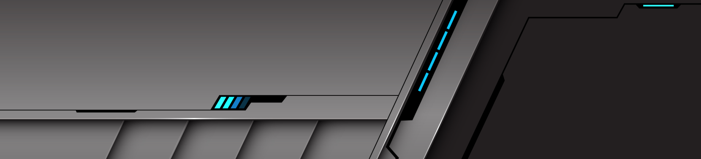

<!-- 

  <picture>
    <source media="(prefers-color-scheme: dark)" srcset="https://raw.githubusercontent.com/Houria-hs/Houria-hs/main/art/header-dark.png">
    
  </picture>

 -->

  <picture>
    <source media="(prefers-color-scheme: dark)" srcset="art/header.png">
    
  </picture>

<!-- <h1 align="center">
  Hey there, I'm Houria
</h1>

  
  
  

 -->

<!-- <h2 align="center">👩‍💻 About Me</h2> -->

<table align="center">
<tr>

<!-- <td width="65%" valign="top">

- 💻 Full Stack Developer passionate about building modern web apps.
- 🌱 Currently learning System Design, Cloud & DevOps.
- 🚀 Building AI-powered projects and contributing to Open Source.
- 🎯 Goal: Create products that solve real-world problems.
- 🌌 Passionate about AI, astronomy, Art,painting, and building things that matter.
- ✨ Always chasing the next idea worth building.
</td> -->

</tr>
</table>

<h2 align="left"> 💻 Tech Stack</h2>

<!-- <h2 align="center">🌐 Let's Connect</h2>

 -->

